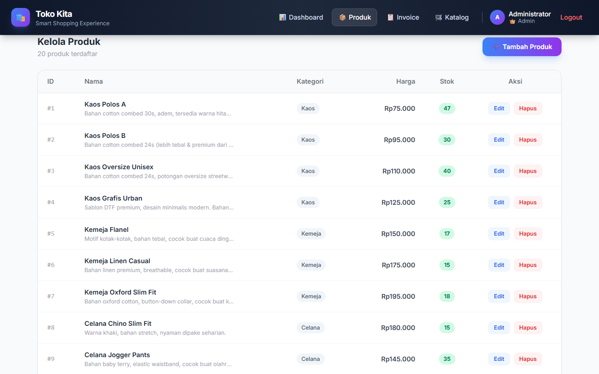
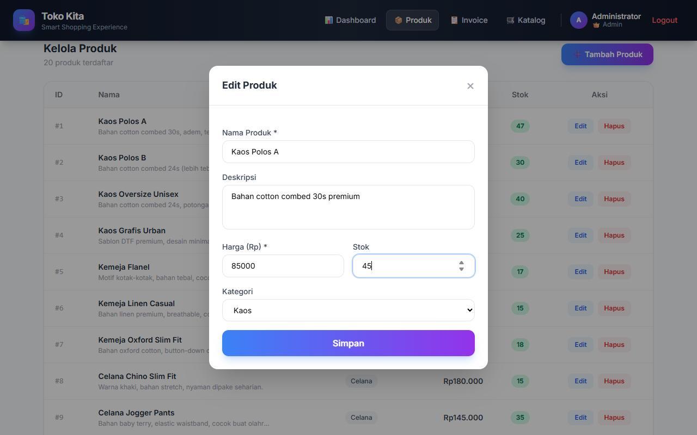
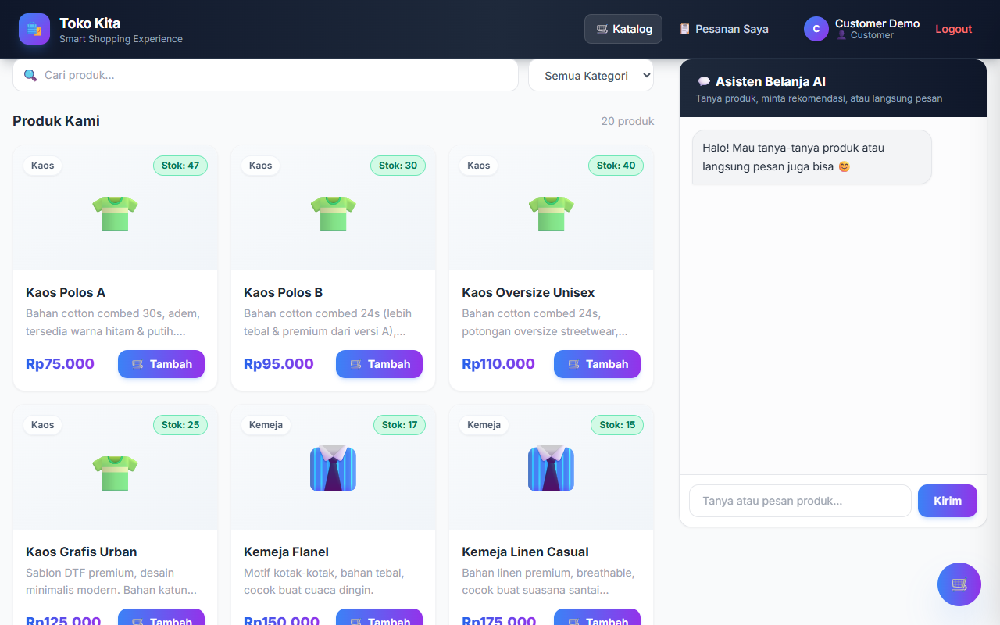
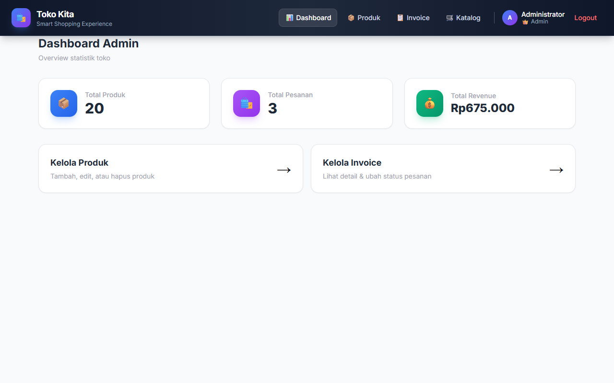
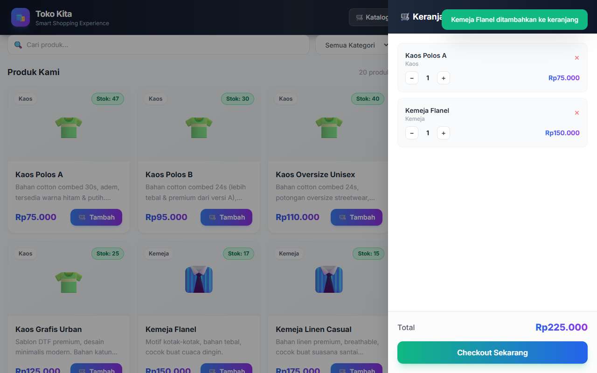
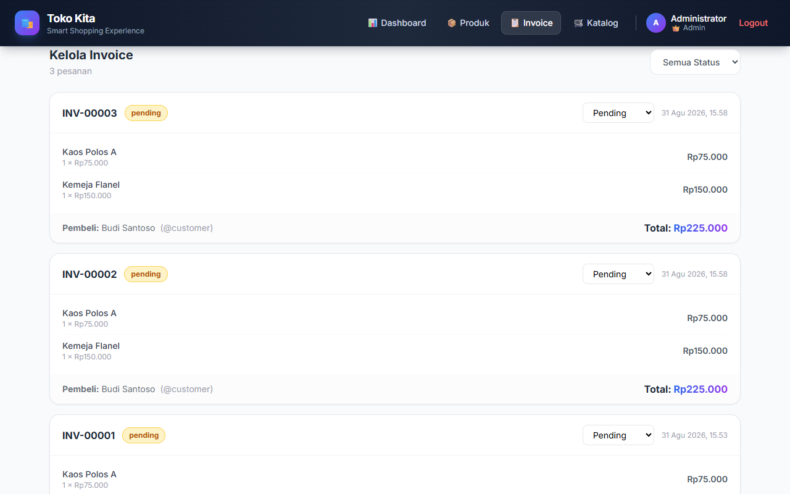
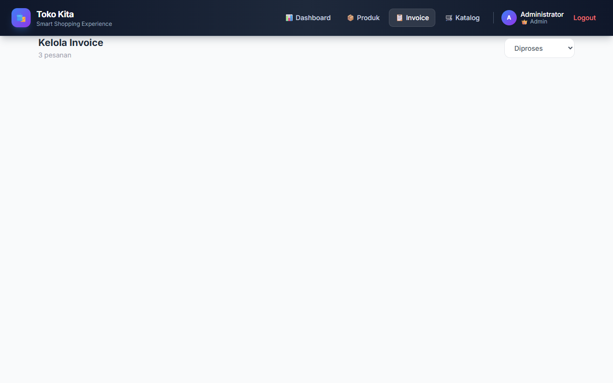
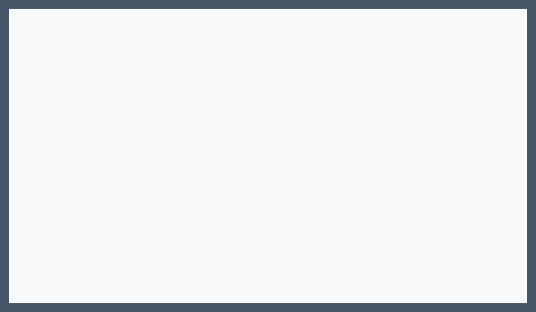
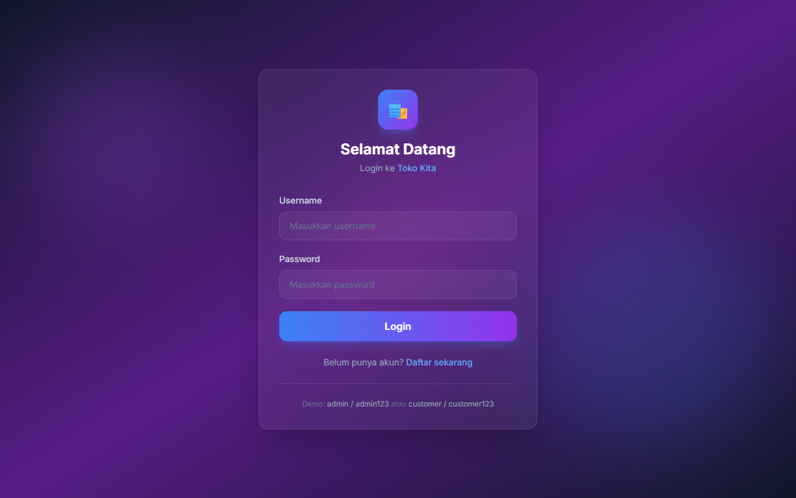

# Laporan Tugas Pertemuan 13 — PAW ANTARA

## 1. Data Produk (Jumlah Banyak)

*Bukti untuk poin nomor 1 (Data Produk): Screenshot halaman katalog produk (`/`) yang menampilkan 20 data produk dalam 7 kategori (Kaos, Kemeja, Celana, Sepatu, Jaket, Tas, Aksesoris). Hal ini membuktikan bahwa data produk berjumlah banyak dan tidak hanya 1-2 data dummy.*

## 2. CRUD Produk (Admin)
### A. Create Produk (Tambah Produk Baru)

*Bukti untuk poin nomor 2 (CRUD Produk - Admin): Screenshot kondisi tabel daftar produk di halaman admin (`/admin/products`) sebelum dilakukan penambahan produk baru.*

*Bukti untuk poin nomor 2 (CRUD Produk - Admin): Screenshot form modal penambahan produk baru ("Jaket Leather Premium", Rp350.000, stok 15) yang diisi oleh admin.*

*Bukti untuk poin nomor 2 (CRUD Produk - Admin): Screenshot kondisi tabel daftar produk setelah produk baru berhasil ditambahkan dan tersimpan ke database (after create).*

### B. Update Produk (Ubah Data Produk)

*Bukti untuk poin nomor 2 (CRUD Produk - Admin): Screenshot modal edit produk yang dibuka admin untuk memperbarui data harga dan stok produk.*

*Bukti untuk poin nomor 2 (CRUD Produk - Admin): Screenshot tabel daftar produk setelah admin berhasil memperbarui harga dan stok produk (after update).*

### C. Delete Produk (Hapus Produk)

*Bukti untuk poin nomor 2 (CRUD Produk - Admin): Screenshot dialog konfirmasi penghapusan produk saat admin menekan tombol hapus.*

*Bukti untuk poin nomor 2 (CRUD Produk - Admin): Screenshot tabel daftar produk setelah item produk berhasil dihapus dari database (after delete).*

## 3. Login 2 Role (Customer & Admin)
### A. Login Customer

*Bukti untuk poin nomor 3 (Login 2 Role): Screenshot akun Customer (`customer` / `customer123`) setelah berhasil login dan diarahkan ke katalog utama (`/`) dengan navbar khusus customer.*

### B. Login Admin

*Bukti untuk poin nomor 3 (Login 2 Role): Screenshot akun Admin (`admin` / `admin123`) setelah berhasil login dan diarahkan ke Dashboard Admin (`/admin`) dengan menu navigasi pengelola.*

## 4. Multiple Order (2+ Produk dalam 1 Transaksi)

*Bukti untuk poin nomor 4 (Multiple Order): Screenshot keranjang belanja yang berisi 2 jenis produk berbeda ("Kaos Polos A" & "Kemeja Flanel") yang dipesan sekaligus dalam 1 kali transaksi.*

*Bukti untuk poin nomor 4 (Multiple Order): Screenshot rincian invoice pesanan yang membuktikan seluruh produk (2+ item) yang dipesan dalam 1 transaksi berhasil tersimpan secara lengkap di database.*

## 5. Invoice & Ubah Status Pesanan (Admin)
### A. Admin Membuka Detail Invoice

*Bukti untuk poin nomor 5 (Invoice & Ubah Status Admin): Screenshot admin membuka halaman detail invoice suatu pesanan (`/invoices/:id`) untuk memeriksa rincian pemesan dan barang.*

### B. Proses Admin Mengubah Status Pesanan (Before → After)

*Bukti untuk poin nomor 5 (Invoice & Ubah Status Admin): Screenshot status awal pesanan yang berada pada status "pending" sebelum diubah oleh admin.*

*Bukti untuk poin nomor 5 (Invoice & Ubah Status Admin): Screenshot status pesanan setelah admin mengubah statusnya menjadi "diproses" / "dikirim" melalui dropdown status.*

## 6. Tampilan UI Akhir

*Bukti untuk poin nomor 6 (Tampilan): Screenshot tampilan akhir halaman katalog produk dengan desain grid modern, filter kategori, dan floating cart button.*

*Bukti untuk poin nomor 6 (Tampilan): Screenshot tampilan akhir halaman login dengan styling Glassmorphism dan warna gradient modern.*

## 7. Penerapan Prinsip DRY (Don't Repeat Yourself)
1. **Service Layer Centralized:** `product.service.js`, `order.service.js`, dan `auth.service.js` menyatukan query dan logika bisnis yang dipanggil oleh Web Route, REST API, Bot Telegram (`/stok`), dan AI Gemini (`buat_pesanan`).
2. **Modular EJS Partials:** Menggunakan partial template (`nav.ejs`, `badge.ejs`, `product-card.ejs`, `status-helper.ejs`) untuk menghindari duplikasi HTML.
3. **Middleware Autentikasi:** Middleware `attachUser`, `requireLogin`, dan `requireAdmin` mengeliminasi duplikasi pengecekan sesi di setiap controller.
